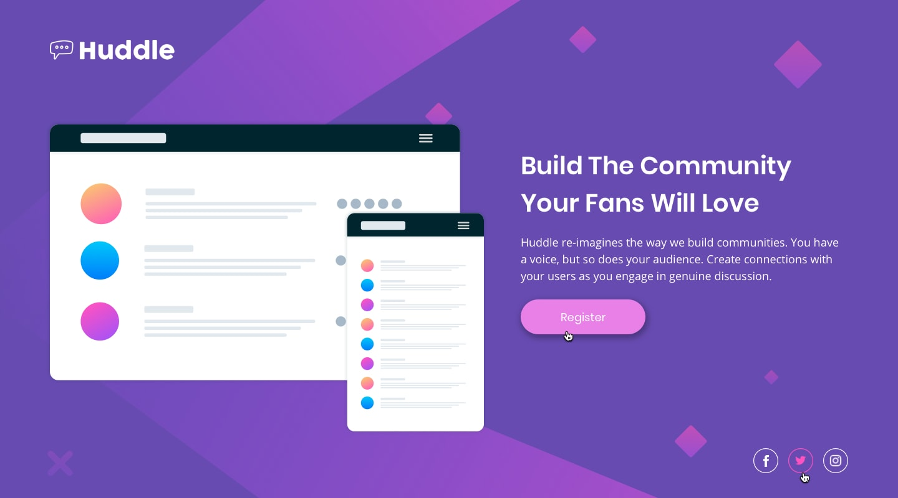

# Frontend Mentor - Página inicial do Huddle com solução de seção introdutória única

Esta é uma solução para o [Huddle landing page with single introductory section challenge on Frontend Mentor](https://www.frontendmentor.io/challenges/huddle-landing-page-with-a-single-introductory-section-B_2Wvxgi0) . Os desafios do Frontend Mentor ajudam você a melhorar suas habilidades de codificação criando projetos realistas.

## Índices 

- [Visão geral](#visão-geral)
  - [O desafio](#o-desafio)
  - [Screenshot](#screenshot)
- [Meu processo](#meu-processo)
  - [Feito com](#feito-com)
  - [O que eu aprendi](#o-que-eu-aprendi)
  - [Recursos úteis](#recursos-úteis)
- [Autor](#autor)

## Visão geral

### O desafio

Os usuários devem ser capazes de:

- Ver o layout ideal para a página, dependendo do tamanho da tela do dispositivo
- Ver os estados de foco para todos os elementos interativos na página

### Screenshot

## Meu processo

### Feito com

- HTML5
- CSS
- Flexbox
- CSS Grid
- Family: [Open Sans](https://fonts.google.com/specimen/Open+Sans) - Weights: 400

### O que eu aprendi

Na verdade, não consegui aprender nada de novo enquanto fazia. Acredito que tenha sido porque tive uma boa base, então, não me faltou conhecimento de código. Compreendo que me falta organização e que talvez o CSS possa ser melhorado, mas não sou capaz de identificar tais coisas ainda. Por tanto, para o meu nível atual, acredito que o desafio estar suficientemente bom.

### Recursos úteis

- [Responsive Viewer](https://chrome.google.com/webstore/detail/responsive-viewer/inmopeiepgfljkpkidclfgbgbmfcennb) - Me ajudou muito, já que minha tela é pequena e o DevTools do chrome bugado muito pra isso.

## Autor

- Thyago dos Santos moura